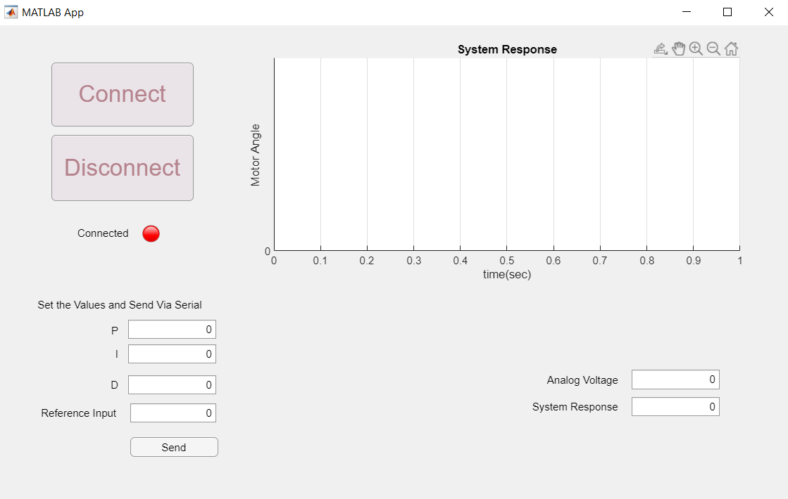

# Automated Watering Control System - GUI

A humidity sensor measures the moisture content of soil which a plant lives in.
According to the measurement, if the soil lacks moisture, water is
transferred from a source into the pot using a dc motor to open a lid.
Until the ideal soil moisture measurement is read from the
sensor, transfer continues. Position tracking of the lid is carried out by using a potentiometer.
A control strategy of the dc motor is implemented according to the position of the lid and moisture measurements.

System aims to reduce the need for maintenance significantly from daily care up to biweekly
care depending on what kind of plant and water source are used.

Control is achieved with aid of an Arduino and controller model is designed in Simulink.
Arduino can be directly connected to the Simulink model and loaded with auto-generated program
via 'Simulink Support Package for Arduino Hardware' add-on.

A GUI was designed using Matlab’s App Designer toolbox. Purpose of the GUI is to
change PID values and see the effects in real time. Also neat presentation of the results can
be shown to the user in the form of figure and numeric values.

